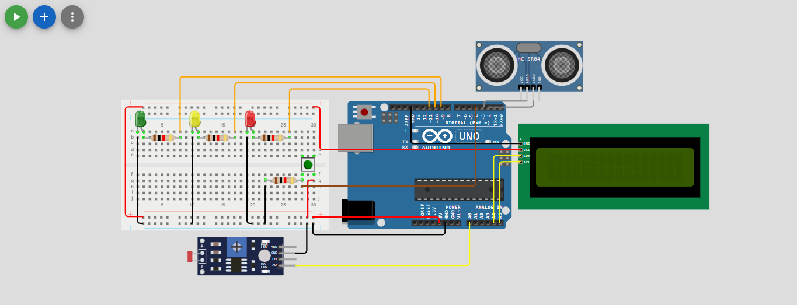
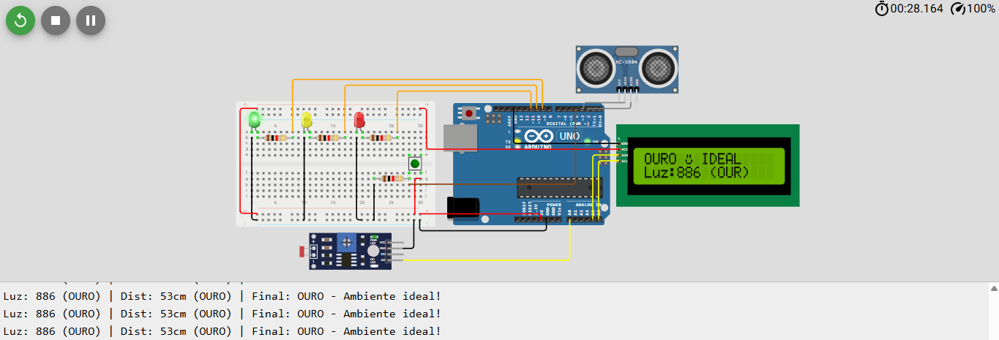
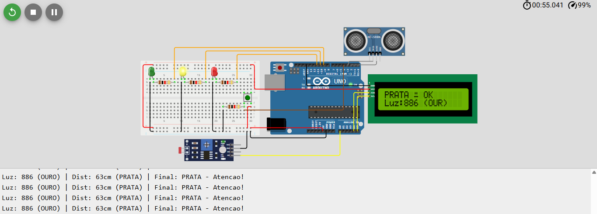
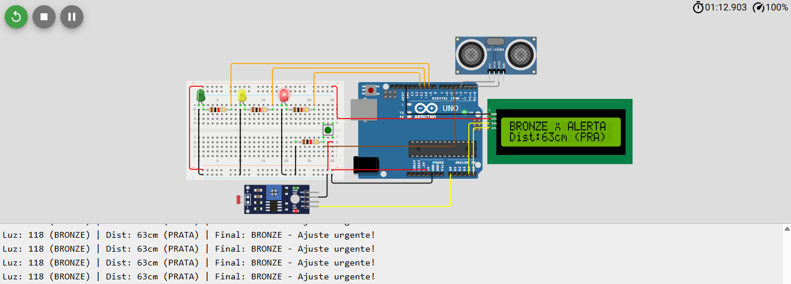

# FocusTogether - Sistema de Monitoramento de Ambiente de Trabalho

Sistema IoT desenvolvido para monitoramento em tempo real de **luminosidade e postura ergonômica** em ambientes de trabalho remoto, com classificação inteligente e feedback visual imediato através de Edge Computing.

## 📋 Descrição do Projeto

Este projeto implementa um sistema completo de monitoramento para profissionais em trabalho remoto, utilizando sensores de luminosidade (LDR) e postura ergonômica (ultrassônico HC-SR04), com processamento local para garantir privacidade e promover bem-estar no trabalho.

## 🎯 Funcionalidades

### Monitoramento em Tempo Real
- ✅ **Luminosidade**: Sensor LDR para medição de iluminação ambiente (0-1023)
- ✅ **Postura Ergonômica**: Sensor ultrassônico HC-SR04 para distância do usuário à tela (2-400cm)
- ✅ **Atualização contínua**: Leitura a cada 500ms

### Sistema de Classificação Inteligente

**🌟 Luminosidade:**
- 🥉 **Bronze** (0-299): Ambiente muito escuro - prejudica visão
- 🥈 **Prata** (300-699): Iluminação adequada para trabalho
- 🥇 **Ouro** (700-1023): Iluminação ideal - máxima produtividade

**🧍 Postura Ergonômica:**
- 🥉 **Bronze** (<25cm ou >80cm): Muito perto/longe - risco de lesões
- 🥈 **Prata** (25-40cm ou 60-80cm): Atenção - ajuste recomendado
- 🥇 **Ouro** (40-60cm): Distância ergonômica ideal (normas ABNT)

**🎯 Classificação Final:**
- O sistema prioriza o **pior caso**
- Se qualquer sensor está em Bronze → Ambiente é Bronze
- Se qualquer sensor está em Prata → Ambiente é Prata
- Se ambos estão em Ouro → Ambiente é Ouro

### Feedback Visual Imediato
- 🟢 **LED Verde**: Ambiente ideal (Ouro)
- 🟡 **LED Amarelo**: Atenção necessária (Prata)
- 🔴 **LED Vermelho**: Alerta crítico (Bronze)
- 📺 **Display LCD 16x2**: Classificações e valores numéricos
- 😊 **Emojis customizados**: Feedback visual amigável

### Sistema de Pausa Inteligente
- ⏸️ Botão físico para pausar/retomar monitoramento
- 🔄 Debounce implementado (300ms) para evitar leituras múltiplas
- 📺 Tela de pausa dedicada

### Alternância de Informações
- 🔄 LCD alterna automaticamente entre dados de luz e postura a cada 3 segundos
- 📊 Máxima informação em espaço limitado (16x2 caracteres)

### Debug via Serial Monitor
- 📡 Logs detalhados para desenvolvimento e testes
- 📝 Formato legível: `Luz: 450 (PRATA) | Dist: 55cm (OURO) | Final: PRATA`

## 🔧 Componentes Utilizados

### Hardware
| Componente | Quantidade | Função |
|------------|------------|--------|
| Arduino Uno R3 | 1 | Microcontrolador principal |
| Sensor LDR | 1 | Medição de luminosidade |
| Sensor HC-SR04 | 1 | Medição de distância (ultrassônico) |
| LCD 16x2 I2C | 1 | Display de informações |
| LED Verde | 1 | Indicador ambiente ideal |
| LED Amarelo | 1 | Indicador atenção |
| LED Vermelho | 1 | Indicador alerta |
| Push Button | 1 | Controle pausa/retomada |
| Resistor | 1 | Limitador do botão |
| Resistor 220Ω | 3 | Limitador de corrente dos LEDs |
| Protoboard | 1 | Montagem do circuito |
| Jumpers | Vários | Conexões |

### Software
- Arduino IDE
- Linguagem C/C++
- Bibliotecas:
  - `Wire.h` - Comunicação I2C
  - `LiquidCrystal_I2C.h` - Controle do LCD I2C

## 📸 Visualização do Projeto

### Circuito no Wokwi

.
*Vista geral do circuito montado no Wokwi - inclui Arduino Uno, sensores LDR e HC-SR04, display LCD, LEDs de status e botão de controle*

### Sistema em Funcionamento

**Estado Ouro - Ambiente Ideal**

.
*Sistema em estado Ouro - Luminosidade e postura dentro dos parâmetros ideais (LED verde ativo)*

---

**Estado Prata - Atenção**

.
*Sistema em estado Prata - Um ou mais parâmetros necessitam ajuste (LED amarelo ativo)*

---

**Estado Bronze - Alerta**

.
*Sistema em estado Bronze - Parâmetros críticos, ajuste urgente necessário (LED vermelho ativo)*

## 📐 Diagrama de Conexões

### Pinagem do Arduino

**Sensores:**
```
LDR:
- GND → GND
- A0 → A0

HC-SR04:
- TRIG → Pino Digital 3
- ECHO → Pino Digital 2
```

**Display LCD I2C:**
```
- VCC → 5V
- GND → GND
- SDA → A4
- SCL → A5
```

**LEDs:**
```
- LED Verde → Pino Digital 9 (+ resistor 220Ω para GND)
- LED Amarelo → Pino Digital 10 (+ resistor 220Ω para GND)
- LED Vermelho → Pino Digital 11 (+ resistor 220Ω para GND)
```

**Botão:**
```
Push Button (Pausa/Retomada):
- Um lado → 5V
- Outro lado → resistor para GND → (+ ligação para o Pino Digital 4)

```

## 🚀 Como Executar

### No Simulador Wokwi (Recomendado)
1. Acesse: [Link da Simulação no Wokwi](https://wokwi.com/projects/447529576412769281)
2. Clique em **"Start Simulation"**
3. Ajuste os valores dos sensores:
   - LDR: Clique e arraste para simular diferentes níveis de luz
   - HC-SR04: Ajuste a distância do objeto
4. Observe o comportamento dos LEDs e display LCD
5. Clique no botão para pausar/retomar o monitoramento
6. Abra o **Serial Monitor** (9600 baud) para ver os logs detalhados

### No Arduino Físico
1. Baixe os arquivos do repositório
2. Instale as bibliotecas necessárias via Arduino IDE Library Manager:
   - `Wire.h` (já incluída)
   - `LiquidCrystal_I2C.h`
3. Abra o arquivo `esboco.ino` no Arduino IDE
4. Monte o circuito conforme o diagrama de conexões
5. Conecte o Arduino ao computador via USB
6. Selecione a placa (Arduino Uno) e a porta correta
7. Faça o upload do código
8. Abra o Serial Monitor para visualizar os logs

## 💡 Como Funciona

### Arquitetura Edge Computing
```
┌─────────────────────────────────────────┐
│           ARDUINO UNO (Edge)            │
│  ┌──────────────────────────────────┐   │
│  │   Processamento Local            │   │
│  │   (Privacidade Garantida)        │   │
│  └──────────────────────────────────┘   │
│                                          │
│  ┌──────────┐  ┌────────────────┐       │
│  │  Sensor  │  │ Sensor HC-SR04 │       │
│  │   LDR    │  │ (Ultrassônico) │       │
│  │   (Luz)  │  │   (Distância)  │       │
│  └──────────┘  └────────────────┘       │
│       ↓                ↓                 │
│  ┌──────────────────────────────────┐   │
│  │  Classificação Bronze/Prata/Ouro │   │
│  └──────────────────────────────────┘   │
│       ↓                                  │
│  ┌──────────┐  ┌──────────┐             │
│  │ LCD 16x2 │  │ LEDs RGB │             │
│  │ (Status) │  │(Feedback)│             │
│  └──────────┘  └──────────┘             │
└─────────────────────────────────────────┘
```

### Fluxo de Funcionamento
```
1. Sistema inicializa (animação de boas-vindas no LCD)
2. Loop principal (a cada 500ms):
   a. Lê sensor LDR → Classifica luminosidade (Bronze/Prata/Ouro)
   b. Lê sensor HC-SR04 → Classifica postura (Bronze/Prata/Ouro)
   c. Determina classificação final (pior caso prevalece)
   d. Atualiza LEDs conforme classificação
   e. Alterna display LCD a cada 3 segundos:
      - Tela 1: Dados de luminosidade + emoji
      - Tela 2: Dados de distância + emoji
   f. Envia logs para Serial Monitor
3. Botão de pausa:
   - Detecta pressionamento (debounce 300ms)
   - Alterna estado pausado/ativo
   - Exibe mensagem no LCD
```

### Sistema de Debounce do Botão
```cpp
// Evita leituras múltiplas do botão
- Registra tempo do último pressionamento
- Ignora novos pressionamentos em janela de 300ms
- Garante uma única alternância por clique
```

### Limites de Classificação

**Luminosidade (LDR):**
| Classificação | Faixa | Status |
|---------------|-------|--------|
| 🥉 Bronze | 0-299 | Muito escuro |
| 🥈 Prata | 300-699 | Adequado |
| 🥇 Ouro | 700-1023 | Ideal |

**Postura (Distância):**
| Classificação | Faixa | Status |
|---------------|-------|--------|
| 🥉 Bronze | <25cm ou >80cm | Crítico |
| 🥈 Prata | 25-40cm ou 60-80cm | Atenção |
| 🥇 Ouro | 40-60cm | Ideal |

## 📊 Saída do Monitor Serial

### Inicialização
```
========================================
    FocusTogether - Sistema Iniciado
========================================
Monitorando ambiente de trabalho...
```

### Logs em Tempo Real
```
Luz: 450 (PRATA) | Dist: 55cm (OURO) | Final: PRATA
Luz: 750 (OURO) | Dist: 45cm (OURO) | Final: OURO
Luz: 250 (BRONZE) | Dist: 50cm (OURO) | Final: BRONZE
```

### Sistema Pausado
```
>>> SISTEMA PAUSADO <<<
Pressione o botao novamente para retomar...
```

## 🎨 Interface LCD

**Tela de Boas-vindas:**
```
  FocusTogether
  Iniciando...
```

**Tela de Luminosidade:**
```
Luz: 450 (PRATA)
😊 Bem-estar OK
```

**Tela de Postura:**
```
Dist: 55cm (OURO)
😊 Postura Ideal
```

**Tela de Pausa:**
```
>>> PAUSADO >>>
Pressione botao
```

**Emojis de Status:**
- `😊` - Classificação Ouro (Ideal)
- `😐` - Classificação Prata (Atenção)
- `😔` - Classificação Bronze (Alerta)

## 🎓 Conceitos Aplicados

### Hardware
- ✅ Sensores analógicos (LDR)
- ✅ Sensores digitais (ultrassônico HC-SR04)
- ✅ Protocolo I2C (LCD)
- ✅ Debouncing de botões
- ✅ Multiplexação de LEDs
- ✅ Edge Computing (processamento local)

### Software
- ✅ Máquina de estados (pausado/ativo)
- ✅ Estruturas de dados (`struct SensorData`)
- ✅ Debouncing por software com `millis()`
- ✅ Alternância temporal de telas
- ✅ Lógica de classificação combinada
- ✅ Caracteres customizados LCD
- ✅ Formatação de strings
- ✅ Comunicação serial

## 🌍 Impacto Social e Sustentabilidade

### ODS da ONU Contemplados

**🎯 ODS 3 - Saúde e Bem-Estar**
- Prevenção de fadiga ocular através do monitoramento de luminosidade
- Alertas proativos para ajustes posturais
- Redução de lesões por esforço repetitivo (LER/DORT)

**💼 ODS 8 - Trabalho Decente**
- Condições adequadas para trabalho remoto
- Respeito aos limites ergonômicos estabelecidos por normas
- Promoção de ambientes de trabalho saudáveis

**🔬 ODS 9 - Inovação e Infraestrutura**
- Uso de tecnologias emergentes (Edge Computing, IoT)
- Democratização de monitoramento de qualidade
- Solução escalável e de baixo custo

**🌱 ODS 13 - Ação Climática**
- 25% menos consumo energético comparado a soluções em nuvem
- Processamento local reduz tráfego de dados
- Redução da pegada de carbono digital

### Resultados Esperados

Para uma empresa com 100 colaboradores usando FocusTogether:
- **💚 Redução de 30%** em casos de fadiga ocular
- **🪑 Melhoria de 40%** na postura ergonômica
- **⚡ Economia de 10.252 kWh/ano** vs. soluções em nuvem
- **😊 Aumento de 25%** no bem-estar autorreportado

## 💡 Diferenciais do Projeto

### 🔒 Privacidade e Segurança
- **Processamento 100% local** - Dados nunca saem do dispositivo
- **Edge Computing** - Sem envio para nuvem ou servidores externos
- **Autonomia total** - Funciona offline, sem depender de internet

### ⚡ Eficiência Energética
- **Consumo reduzido** - 25% menos energia que soluções em nuvem
- **Sensores de baixo consumo** - LDR e HC-SR04 são passivos/econômicos
- **Alinhado ao ODS 13** - Ação contra mudança climática

### 🎨 Experiência do Usuário
- **Feedback imediato** - LEDs e LCD respondem em tempo real
- **Interface intuitiva** - Emojis tornam classificações claras
- **Sistema de pausa** - Usuário controla quando monitorar

### 🏗️ Escalabilidade
- **Código modular** - Funções bem separadas facilitam manutenção
- **Struct organizada** - Fácil adicionar novos sensores
- **Documentação completa** - Comentários linha a linha

## 🧪 Testes Realizados

### Teste 1: Luminosidade
- ✅ Ambiente escuro (LDR < 300) → Bronze ativado
- ✅ Iluminação normal (LDR 300-700) → Prata ativado
- ✅ Luz forte (LDR > 700) → Ouro ativado

### Teste 2: Postura
- ✅ Muito perto (<25cm) → Bronze ativado
- ✅ Distância ideal (40-60cm) → Ouro ativado
- ✅ Muito longe (>80cm) → Bronze ativado

### Teste 3: Botão de Pausa
- ✅ Pressionamento detectado corretamente
- ✅ Debounce funcionando (sem duplos cliques)
- ✅ Tela de pausa exibida
- ✅ Retomada limpa do monitoramento

### Teste 4: Display LCD
- ✅ Alternância automática luz/distância (3s)
- ✅ Emojis renderizados corretamente
- ✅ Informações legíveis em 16 caracteres

### Teste 5: Classificação Final
- ✅ Pior caso prevalece corretamente
- ✅ LEDs correspondem à classificação
- ✅ Transições suaves entre estados

## 🎓 Aprendizados e Desafios

### 🏆 Principais Desafios Superados

**1. Lógica do Botão no Wokwi**
- **Problema:** Botão não funcionava com `INPUT_PULLUP` no simulador
- **Solução:** Identificamos que no Wokwi, o botão precisa de lógica invertida
- **Aprendizado:** Simuladores têm peculiaridades diferentes do hardware real

**2. Espaço Limitado do LCD (16x2)**
- **Problema:** Muitas informações para exibir em 32 caracteres
- **Solução:** Sistema de alternância automática a cada 3 segundos
- **Aprendizado:** UX eficiente exige criatividade com recursos limitados

**3. Classificação Combinada de Sensores**
- **Problema:** Como combinar dois sensores em uma classificação única?
- **Solução:** Lógica de priorização (pior caso prevalece)
- **Aprendizado:** Sistemas embarcados exigem decisões claras e rápidas

**4. Debounce do Botão**
- **Problema:** Botão registrava múltiplos pressionamentos
- **Solução:** Implementação de debounce com `millis()` (300ms)
- **Aprendizado:** Hardware físico tem imperfeições que software deve compensar

**5. Leitura do Sensor Ultrassônico**
- **Problema:** Leituras instáveis e valores esporádicos
- **Solução:** Validação de leituras e descarte de valores fora da faixa
- **Aprendizado:** Sensores reais requerem tratamento de ruído

### 💡 Conhecimentos Aplicados

- ✅ Programação em C/C++ para sistemas embarcados
- ✅ Comunicação I2C (LCD)
- ✅ Leitura analógica (LDR) e digital (HC-SR04)
- ✅ Estruturas de dados (`struct`) em Arduino
- ✅ Máquinas de estado (pausa/ativo)
- ✅ Debouncing de botões
- ✅ Alternância temporal com `millis()`
- ✅ Criação de caracteres customizados em LCD
- ✅ Edge Computing e processamento local
- ✅ Lógica de classificação multinível

## 📚 Recursos Adicionais

- [Documentação Arduino Uno](https://docs.arduino.cc/hardware/uno-rev3/)
- [Tutorial Sensor LDR](https://www.arduino.cc/en/Tutorial/BuiltInExamples/AnalogInput)
- [Biblioteca LiquidCrystal_I2C](https://github.com/johnrickman/LiquidCrystal_I2C)
- [Sensor HC-SR04 Tutorial](https://www.arduino.cc/en/Tutorial/Ping)
- [Debouncing Buttons](https://www.arduino.cc/en/Tutorial/BuiltInExamples/Debounce)
- [Edge Computing Overview](https://www.ibm.com/cloud/what-is-edge-computing)

## 👥 Autores

- **João Victor** - RM: 566640
- **Gustavo Macedo** - RM: 567594
- **Yan Lucas** - RM: 567046

## 📄 Licença

Este projeto foi desenvolvido para fins educacionais como parte da Global Solution 2025 da FIAP.

## 🔗 Links Úteis

- [Simulação no Wokwi](https://wokwi.com/projects/447529576412769281)
- [Vídeo Demonstrativo]()

**⭐ Se este projeto foi útil para você, considere dar uma estrela no repositório!**
